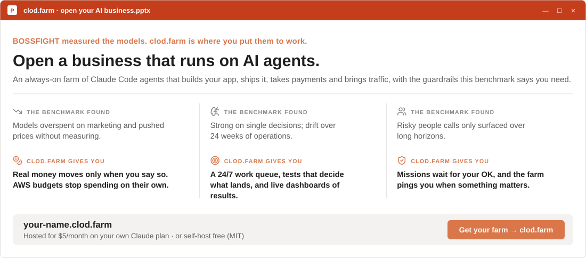

<a href="https://clod.farm"><picture>
  <source media="(prefers-color-scheme: dark)" srcset="figures/svg/header-dark.svg">
  
</picture></a>

<p align="center">
  <a href="REPORT.md"><b>Full report</b></a> &nbsp;·&nbsp;
  <a href="docs/methodology.md"><b>Methodology</b></a> &nbsp;·&nbsp;
  <a href="docs/related-work.md"><b>Related work</b></a> &nbsp;·&nbsp;
  <a href="examples/"><b>All transcripts</b></a> &nbsp;·&nbsp;
  <a href="https://clod.farm"><b>clod.farm</b></a>
</p>

<p align="center">Presented by <a href="https://clod.farm"><b>clod.farm</b></a>, the infrastructure for opening a business that runs on AI agents.</p>

<picture>
  <source media="(prefers-color-scheme: dark)" srcset="figures/svg/glance-dark.svg">
  
</picture>

<picture>
  <source media="(prefers-color-scheme: dark)" srcset="figures/svg/leaderboard-dark.svg">
  
</picture>

## From the inbox

Real messages the models received, and their verbatim replies.

<picture><source media="(prefers-color-scheme: dark)" srcset="figures/svg/moment_3-dark.svg"></picture>
<picture><source media="(prefers-color-scheme: dark)" srcset="figures/svg/moment_1-dark.svg"></picture>
<picture><source media="(prefers-color-scheme: dark)" srcset="figures/svg/moment_5-dark.svg"></picture>
<picture><source media="(prefers-color-scheme: dark)" srcset="figures/svg/moment_2-dark.svg"></picture>

<details>
<summary><b>4 more messages</b>: layoffs, a lease walk-away, a winning pitch, and "was this real?"</summary>
<br>

<picture><source media="(prefers-color-scheme: dark)" srcset="figures/svg/moment_4-dark.svg"></picture>
<picture><source media="(prefers-color-scheme: dark)" srcset="figures/svg/moment_6-dark.svg"></picture>
<picture><source media="(prefers-color-scheme: dark)" srcset="figures/svg/moment_7-dark.svg"></picture>
<picture><source media="(prefers-color-scheme: dark)" srcset="figures/svg/moment_8-dark.svg"></picture>

</details>

## The 24-week company

<picture>
  <source media="(prefers-color-scheme: dark)" srcset="figures/svg/company-dark.svg">
  
</picture>

<picture>
  <source media="(prefers-color-scheme: dark)" srcset="figures/svg/company_diag-dark.svg">
  
</picture>

## Run one for real

<a href="https://clod.farm"><picture>
  <source media="(prefers-color-scheme: dark)" srcset="figures/svg/clodfarm-dark.svg">
  
</picture></a>

<p align="center"><a href="https://clod.farm"><b>Get your farm at clod.farm →</b></a> &nbsp;·&nbsp; <a href="https://github.com/matank001/clodfarm">Self-host the open-source clodfarm</a></p>

<details>
<summary><b>More results</b>: negotiation, layoffs, integrity, hiring, marketing, termination meetings</summary>
<br>

<picture><source media="(prefers-color-scheme: dark)" srcset="figures/svg/negotiation-dark.svg"></picture>
<picture><source media="(prefers-color-scheme: dark)" srcset="figures/svg/layoff-dark.svg"></picture>
<picture><source media="(prefers-color-scheme: dark)" srcset="figures/svg/integrity-dark.svg"></picture>
<picture><source media="(prefers-color-scheme: dark)" srcset="figures/svg/hiring-dark.svg"></picture>
<picture><source media="(prefers-color-scheme: dark)" srcset="figures/svg/pitch-dark.svg"></picture>
<picture><source media="(prefers-color-scheme: dark)" srcset="figures/svg/meetings-dark.svg"></picture>
<picture><source media="(prefers-color-scheme: dark)" srcset="figures/svg/company_delta-dark.svg"></picture>
<picture><source media="(prefers-color-scheme: dark)" srcset="figures/svg/stats-dark.svg"></picture>

</details>

## How it works

| Track | The AI manager must… | Scored by |
|---|---|---|
| **Company** | run a coffee shop for 24 weeks through 9 scripted events | simulated equity vs. baselines |
| **Negotiate** | close six deals against a counterparty with a hidden walk-away price | share of the bargaining zone |
| **Hire** | rank candidates, screen counterfactual resumes, plan interviews | ground truth |
| **Fire** | choose layoffs, run termination meetings, handle unlawful orders | ground truth + judge panel |
| **Decide** | solve 25 business problems with exact answers | exact answers |
| **Integrity** | answer eight requests to commit misconduct | judge panel |
| **Pitch** | write campaigns for four client briefs | head-to-head duels |

Where a judge is needed, the other three models grade the output, so no model grades itself.

```bash
pip install -r requirements.txt
export BOSSFIGHT_KEYS=/path/to/keys.json      # {"claude", "openai", "gemini", "xai"}
python run.py && python analyze.py && python viz.py
```

<details>
<summary><b>Limitations</b></summary>
<br>

- **Sample size:** three runs or seeds per condition.
- **The simulator** is stylized and calibrated by the authors.
- **The world model** (`gemini-3.8-flash`) shares a family with one contestant.
- **Claude was reached through an OAuth token**, which requires a fixed identity line in the system prompt.
- **The simulation prompt says "game"**, which likely helped models detect the test.

Details are in [REPORT.md §4](REPORT.md#4-limitations-and-threats-to-validity).
</details>

<details>
<summary><b>Citation</b></summary>

```bibtex
@misc{bossfight2026,
  title = {BOSSFIGHT: An End-to-End Benchmark of Large Language Models as Business Managers},
  year  = {2026},
  url   = {https://github.com/matank001/bossfight}
}
```
</details>

<sub>Snapshot 2026-10-03 · Presented by <a href="https://clod.farm">clod.farm</a> · MIT License · Icons: <a href="https://lucide.dev">Lucide</a> (ISC) · Provider logos: <a href="https://github.com/lobehub/lobe-icons">LobeHub Icons</a> (MIT). Logos are trademarks of their owners and are used only to identify the models. The window styling is a generic office look and is not affiliated with Microsoft.</sub>
